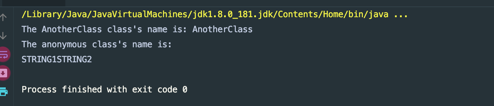
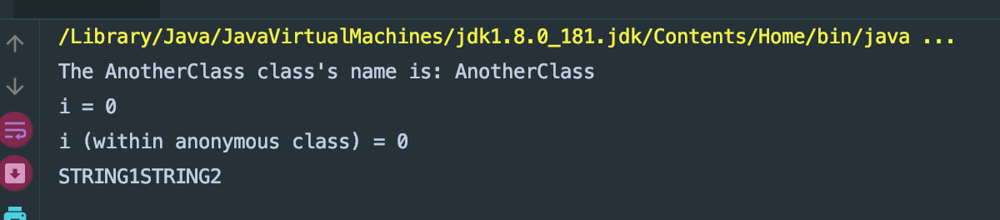

### example:

- let's create a folder `Lambda_NestedBlock`
```java
import java.util.*;
public class Main {
    public static void main(String[] args) {

        Employee john = new Employee("John Doe", 30);
        Employee tim = new Employee("Tim Buchalka", 21);
        Employee jack = new Employee("Jack Hill", 40);
        Employee snow = new Employee("Snow White", 22);

        List<Employee> employees = new ArrayList<>();
        employees.add(john);
        employees.add(tim);
        employees.add(jack);
        employees.add(snow);

        AnotherClass anotherClass = new AnotherClass();
        String s = anotherClass.doSomething();
        System.out.println(s);
    }

    public final static String doStringStuff(UpperConcat uc, String s1, String s2){
        return uc.upperAndConcat(s1, s2);
    }
}

class Employee{
    private String name;
    private int age;

    public Employee(String name, int age) {
        this.name = name;
        this.age = age;
    }

    public void setName(String name) {
        this.name = name;
    }

    public void setAge(int age) {
        this.age = age;
    }

    public String getName() {
        return name;
    }

    public int getAge() {
        return age;
    }
}

//concat: 合并多个数组
interface UpperConcat{
    public String upperAndConcat(String s1, String s2);
}

class AnotherClass{
    public String doSomething() {
        System.out.println("The AnotherClass class's name is: " + getClass().getSimpleName());
        return
        Main.doStringStuff(new UpperConcat() {
            @Override
            public String upperAndConcat(String s1, String s2) {
                System.out.println("The anonymous class's name is: " + getClass().getSimpleName());
                return s1.toUpperCase() + s2.toUpperCase();
            }
        }, "String1", "String2");
    }
}
```


- we can't see anonymous class's name, since anonymous doesn't have a 
  name which make sense

- but let's use a lambda expression instead of an anonymous class

- update
```java
import java.util.*;
public class Main {
    public static void main(String[] args) {

        Employee john = new Employee("John Doe", 30);
        Employee tim = new Employee("Tim Buchalka", 21);
        Employee jack = new Employee("Jack Hill", 40);
        Employee snow = new Employee("Snow White", 22);

        List<Employee> employees = new ArrayList<>();
        employees.add(john);
        employees.add(tim);
        employees.add(jack);
        employees.add(snow);

        AnotherClass anotherClass = new AnotherClass();
        String s = anotherClass.doSomething();
        System.out.println(s);
    }

    public final static String doStringStuff(UpperConcat uc, String s1, String s2){
        return uc.upperAndConcat(s1, s2);
    }
}

class Employee{
    private String name;
    private int age;

    public Employee(String name, int age) {
        this.name = name;
        this.age = age;
    }

    public void setName(String name) {
        this.name = name;
    }

    public void setAge(int age) {
        this.age = age;
    }

    public String getName() {
        return name;
    }

    public int getAge() {
        return age;
    }
}

//concat: 合并多个数组
interface UpperConcat{
    public String upperAndConcat(String s1, String s2);
}

class AnotherClass{
    public String doSomething() {
        UpperConcat uc = (s1, s2) -> {
            System.out.println("The lambda expression's class is " + getClass().getSimpleName());
            String result = s1.toUpperCase() + s2.toUpperCase();
            return result;
        };
        System.out.println("The AnotherClass class's name is: " + getClass().getSimpleName());
        return Main.doStringStuff(uc, "String1", "String2");
    }
}
```
- the same result.
---


### new example:

```java
import java.util.*;
public class Main {
    public static void main(String[] args) {

        Employee john = new Employee("John Doe", 30);
        Employee tim = new Employee("Tim Buchalka", 21);
        Employee jack = new Employee("Jack Hill", 40);
        Employee snow = new Employee("Snow White", 22);

        List<Employee> employees = new ArrayList<>();
        employees.add(john);
        employees.add(tim);
        employees.add(jack);
        employees.add(snow);

        AnotherClass anotherClass = new AnotherClass();
        String s = anotherClass.doSomething();
        System.out.println(s);
    }

    public final static String doStringStuff(UpperConcat uc, String s1, String s2){
        return uc.upperAndConcat(s1, s2);
    }
}

class Employee{
    private String name;
    private int age;

    public Employee(String name, int age) {
        this.name = name;
        this.age = age;
    }

    public void setName(String name) {
        this.name = name;
    }

    public void setAge(int age) {
        this.age = age;
    }

    public String getName() {
        return name;
    }

    public int getAge() {
        return age;
    }
}

//concat: 合并多个数组
interface UpperConcat{
    public String upperAndConcat(String s1, String s2);
}

class AnotherClass{
    public String doSomething() {

        final int i = 0;
        {
            UpperConcat uc = new UpperConcat() {
                @Override
                public String upperAndConcat(String s1, String s2) {
                    System.out.println("i (within anonymous class) = " + i);
                    return s1.toUpperCase() + s2.toUpperCase();
                }
            };
            System.out.println("The AnotherClass class's name is: " + getClass().getSimpleName());

            System.out.println("i = " + i);
            return Main.doStringStuff(uc, "String1", "String2");
        }

    }
}

```

---


