### java.io.OutputStream
- OutputStream: 输出字节流的super class
    1. 操作的数据是字节， 不管什么文件(CD,gif,png,txt...etc)
    2. 定义了输出字节流的基本性功能
    3. 输出流中定义的都是write methods
    4. 操作字节数据，操作单个字节
    5. subclass规律：所有subclass的名称suffix是super class'name. Direct Known Subclasses:`ByteArrayOutputStream, FileOutputStream, FilterOutputStream, ObjectOutputStream, OutputStream, PipedOutputStream`
    6. 前缀名是是这个流对象功能
    7. 想要操作文件：FileOutputStream

- create a new class
- FileOutputStreamDemo.java
```java
import java.io.File;
import java.io.FileNotFoundException;
import java.io.FileOutputStream;

public class FileOutputStreamDemo {
    public static void main(String[] args) throws FileNotFoundException {
        // write data into file
        //创建临时目录
        File dir = new File("tempfile");
        if (!dir.exists()) {
            dir.mkdir();
        }

        //创建存储数据的文件
        File file = new File(dir, "file.txt");

        //创建一个用于操作文件的字节输出流对象，一创建就必须明确数据存储目的地
        //输出流目的是文件，会自动创建。 如果文件存在则覆盖        
        FileOutputStream fos = new FileOutputStream(file);   
    }
}
```
- running

- there is new foler `tempfile/file.txt`
-
- try to write bytes to file
- update
```java
public class FileOutputStreamDemo {
    public static void main(String[] args) throws IOException {
        // write data into file
        //创建临时目录
        File dir = new File("tempfile");
        if (!dir.exists()) {
            dir.mkdir();
        }

        //创建存储数据的文件
        File file = new File(dir, "file.txt");

        //创建一个用于操作文件的字节输出流对象，一创建就必须明确数据存储目的地
        //输出流目的是文件，会自动创建。 如果文件存在则覆盖
        FileOutputStream fos = new FileOutputStream(file);

        //call superclass(OutputStream)'s write() method
        byte[] data = "abcdef".getBytes();
        fos.write(data);

        //close system source
        fos.close();
    }
}
```
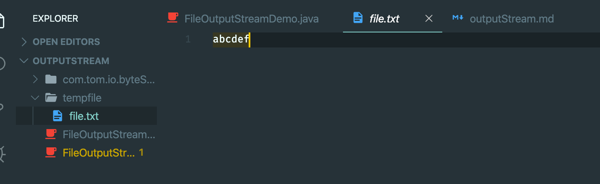
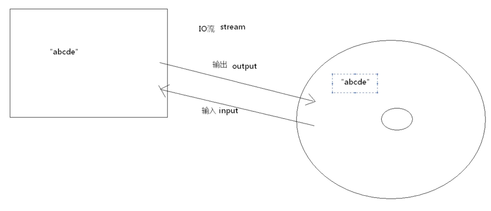
---


### 字节输出流 ｜ 续写& change new line
```java
import java.io.File;
import java.io.FileOutputStream;
import java.io.IOException;
/**
 * FileOutputStreamDemo2
 */
public class FileOutputStreamDemo2 {
    public static void main(String[] args) throws IOException {
        //将数据续写到已有的文件中
        //public FileOutputStream(File file, boolean append) 
        //If the second argument is true, then bytes will be written to the end of the file rather than the beginning

        File file = new File("../tempfile/file.txt");

        FileOutputStream fos = new FileOutputStream(file, true);

        fos.write("Hello World!".getBytes());
        
        fos.close();
    }
}
```
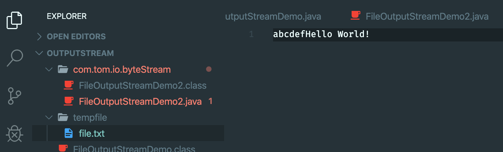
---
-
- change line
- FileOutputStreamDemo2.java
```java
    public static void main(String[] args) throws IOException {
        //将数据续写到已有的文件中
        //public FileOutputStream(File file, boolean append) 
        //If the second argument is true, then bytes will be written to the end of the file rather than the beginning

        //换行，写入新数据

        File file = new File("../tempfile/file.txt");

        FileOutputStream fos = new FileOutputStream(file, true);

        // fos.write("Hello World!".getBytes());
        fos.write("\rjava".getBytes());
        
        fos.close();
    }
``` 
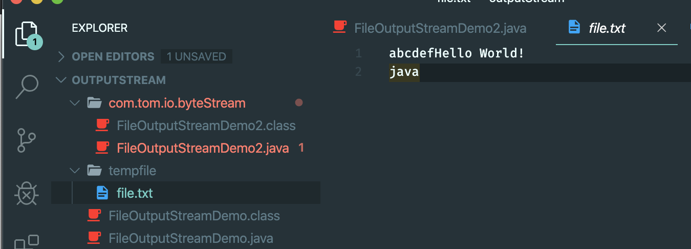
-
- 2nd way
```java
public class FileOutputStreamDemo2 {
    private static final String LINE_SEPARATOR = System.getProperty("line.separator");

    public static void main(String[] args) throws IOException {
        //将数据续写到已有的文件中
        //public FileOutputStream(File file, boolean append) 
        //If the second argument is true, then bytes will be written to the end of the file rather than the beginning

        //换行，写入新数据

        File file = new File("../tempfile/file.txt");

        FileOutputStream fos = new FileOutputStream(file, true);

        String str = LINE_SEPARATOR +"change line";
        fos.write(str.getBytes());
        
        fos.close();
    }
}
```
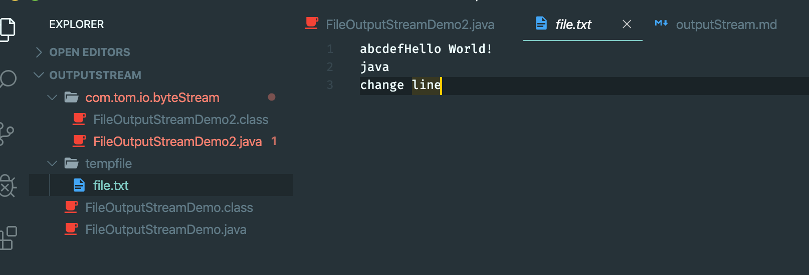
- note: for `System.getProperty()`, its keys:
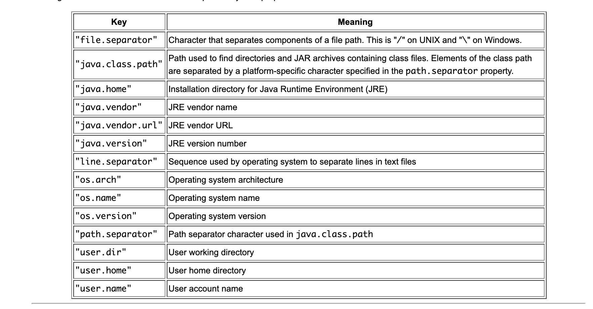
---

### 读取数据
- InputStream: 字节输入流的superclass
        1. `int read()` : 读取一个字节并返回，没有返回-1
        2. `int read(byte[])`: 读取一定量的字节数，并存储到字节数组中，返回读取到的字节数 
        3. 用于读取文件的字节输入流： FileInputStream

-
```java
public class FileInputStreamDemo {

    public static void main(String[] args) throws IOException {
        File file = new File("../tempfile/file.txt");

        //创建一个字节输入流对象,必须明确数据源，其实就是创建字节读取流和数据源相关联
        FileInputStream fis = new FileInputStream(file);

        //读取数据 使用read(); 一次读一个字节
        int ch1 = fis.read();
        System.out.println("ch1="+(char)ch1 );
        
        fis.close();
    }
}
```

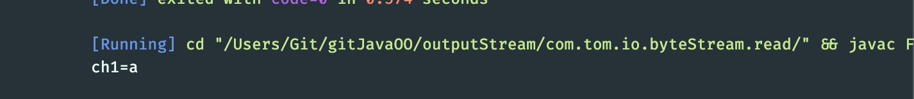
---

- since, `.read()` 一次读取下一个字节, pointer point to next
```java
    public static void main(String[] args) throws IOException {
        File file = new File("../tempfile/file.txt");

        //创建一个字节输入流对象,必须明确数据源，其实就是创建字节读取流和数据源相关联
        FileInputStream fis = new FileInputStream(file);

        //读取数据 使用read(); 一次读一个字节
        int ch1 = fis.read();//97
        System.out.println("ch1="+(char)ch1 );
        int ch2 = fis.read();//98
        System.out.println("ch2="+(char)ch2 );
        int ch3 = fis.read();
        System.out.println("ch3="+(char)ch3 );
        int ch4 = fis.read();
        System.out.println("ch4="+(char)ch4 );
        int ch5 = fis.read();
        System.out.println("ch5="+(char)ch5 );
        
        fis.close();
    }
```
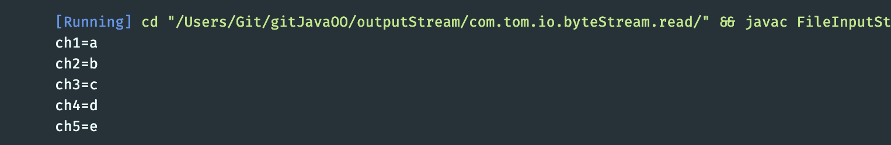
- we can use while loop:
```java
public class FileInputStreamDemo {

    public static void main(String[] args) throws IOException {
        File file = new File("../tempfile/file.txt");

        //创建一个字节输入流对象,必须明确数据源，其实就是创建字节读取流和数据源相关联
        FileInputStream fis = new FileInputStream(file);
        
        int ch=0;
        while((ch=fis.read()) != -1){
            System.out.println("ch="+ (char)ch);
        }
        if((ch=fis.read()) == -1){
            System.out.println(ch);
        }
        fis.close();
    }
}
```
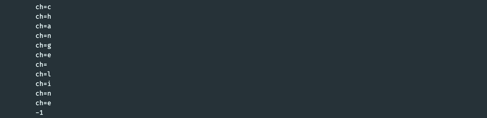
- when the end is null, print -1
---


### 读取数据 `int read(byte[] b)`
```java
public class FileInputStreamDemo2 {
    public static void main(String[] args) throws IOException {
        /**
         * 2nd way to read; read(byte[])
         */
        File file = new File("../tempfile/file1.txt");

        FileInputStream fis = new FileInputStream(file);

        //创建一个字节数组
        byte[] buffer = new byte[2];

        int len1 = fis.read(buffer);//read(byte[] b), return the total number of bytes read into the buffer,
        System.out.println(len1 + ":" + new String(buffer));
    }
    
}
```
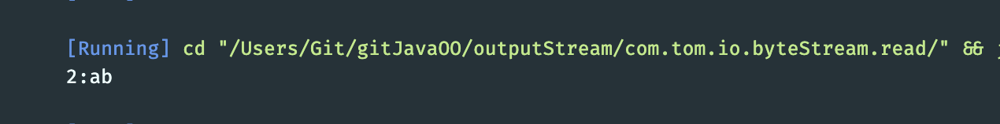
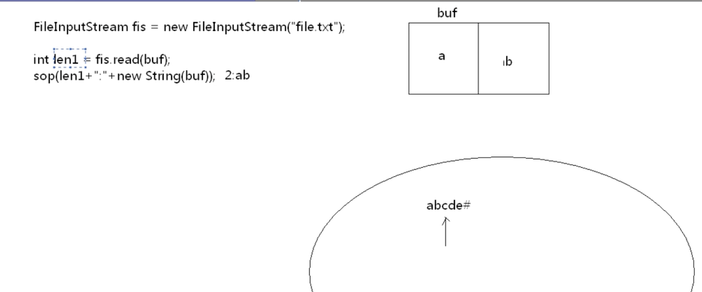
```java
    public static void main(String[] args) throws IOException {
        /**
         * 2nd way to read; read(byte[])
         */
        File file = new File("../tempfile/file1.txt");

        FileInputStream fis = new FileInputStream(file);

        //创建一个字节数组
        byte[] buffer = new byte[2];

        int len1 = fis.read(buffer);//read(byte[] b), return the total number of bytes read into the buffer,
        System.out.println(len1 + ":" + new String(buffer));

        int len2 = fis.read(buffer);//read(byte[] b), return the total number of bytes read into the buffer,
        System.out.println(len2 + ":" + new String(buffer));
    }
```
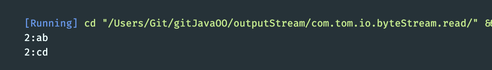
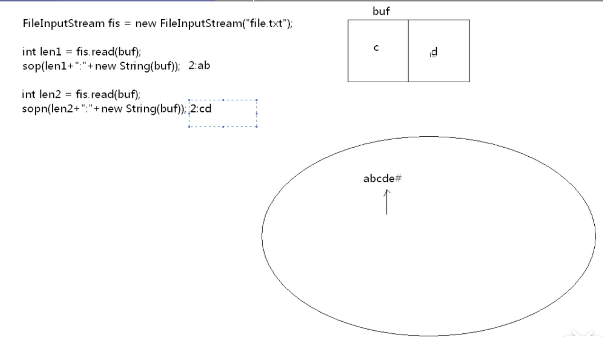
- update
```java
    public static void main(String[] args) throws IOException {
        /**
         * 2nd way to read; read(byte[])
         */
        File file = new File("../tempfile/file1.txt");

        FileInputStream fis = new FileInputStream(file);

        //创建一个字节数组
        byte[] buffer = new byte[2];

        int len1 = fis.read(buffer);//read(byte[] b), return the total number of bytes read into the buffer,
        System.out.println(len1 + ":" + new String(buffer));

        int len2 = fis.read(buffer);//read(byte[] b), return the total number of bytes read into the buffer,
        System.out.println(len2 + ":" + new String(buffer));

        int len3 = fis.read(buffer);//read(byte[] b), return the total number of bytes read into the buffer,
        System.out.println(len3 + ":" + new String(buffer));
    }
```
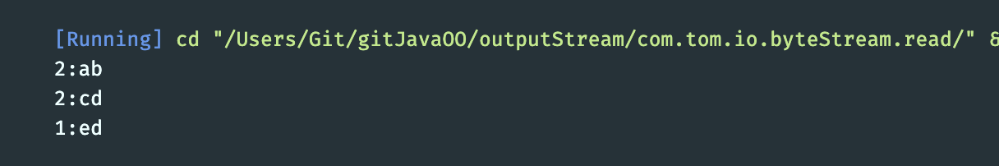
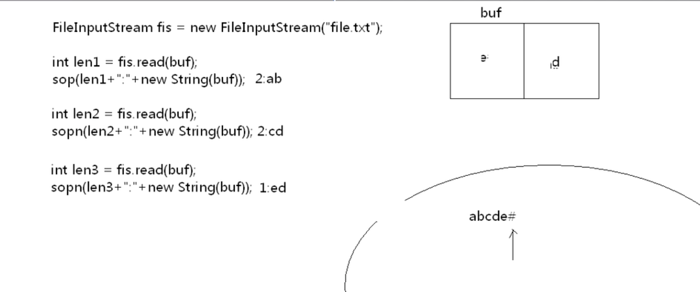
- update
```java
    public static void main(String[] args) throws IOException {
        /**
         * 2nd way to read; read(byte[])
         */
        File file = new File("../tempfile/file1.txt");

        FileInputStream fis = new FileInputStream(file);

        //创建一个字节数组
        byte[] buffer = new byte[2];

        int len1 = fis.read(buffer);//read(byte[] b), return the total number of bytes read into the buffer,
        System.out.println(len1 + ":" + new String(buffer));

        int len2 = fis.read(buffer);//read(byte[] b), return the total number of bytes read into the buffer,
        System.out.println(len2 + ":" + new String(buffer));

        int len3 = fis.read(buffer);//read(byte[] b), return the total number of bytes read into the buffer,
        System.out.println(len3 + ":" + new String(buffer));

        int len4 = fis.read(buffer);//read(byte[] b), return the total number of bytes read into the buffer,
        System.out.println(len4 + ":" + new String(buffer));
    }
```
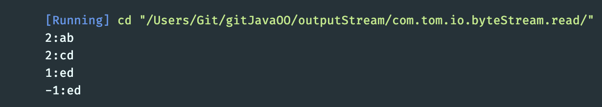
---

### 2nd way `int read(byte[] b)`
```java
import java.io.File;
import java.io.FileInputStream;
import java.io.IOException;

//int read(byte[] b)
/**
 * FileInputStreamDemo2
 */
public class FileInputStreamDemo2 {
    public static void main(String[] args) throws IOException {
        /**
         * 2nd way to read; read(byte[])
         */
        File file = new File("../tempfile/file1.txt");

        FileInputStream fis = new FileInputStream(file);

        //创建一个字节数组
        byte[] buffer = new byte[2];

        int len = 0;
        while((len=fis.read(buffer)) != -1){
            System.out.println(new String(buffer, 0, len));
        }

        fis.close();
    }
}
```
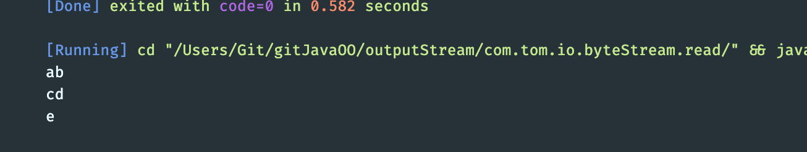
---


### 复制文件
- create `CopyFileTest.java`
```java
import java.io.File;
import java.io.FileInputStream;
import java.io.FileOutputStream;
import java.io.IOException;

/**
 * CopyFileTest
 */
public class CopyFileTest {

    public static void main(String[] args) throws IOException {
        /**
         * 复制文件
         */
        //1.明确源文件，和目的文件
        File srcFile = new File("../tempfile/file.txt");
        File destFile = new File("../tempfile/copy_file.txt");

        //2.明确字节输入流和源相关联，输出流和目的相连
        FileInputStream fis = new FileInputStream(srcFile);
        FileOutputStream fos = new FileOutputStream(destFile);

        //3. 使用输入流的读取方法读取字节，并将字节写入到目的中
        int ch=0;
        while((ch=fis.read())!=-1){
            fos.write(ch);
        }

        //4.close
        fos.close();
        fis.close();
    }
}
```
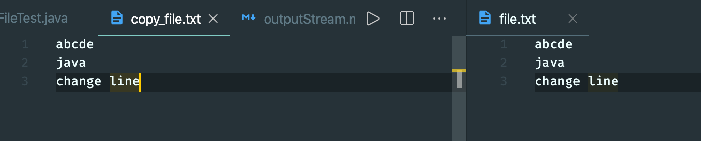
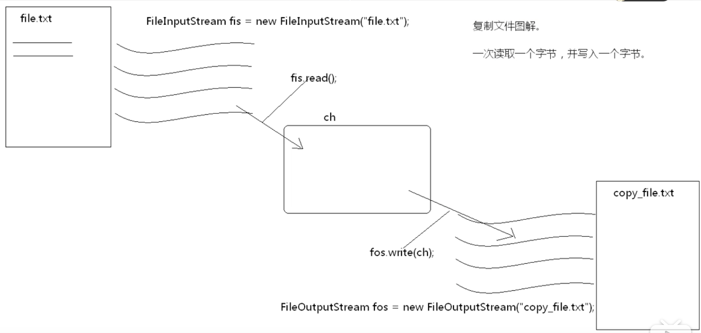
---

### 自定义缓冲数组复制文件
### Note: 前面提过，所有文件都是字节形式，包括`.mp3 .png .jpg .mp4 .mkv`, 这就意味着接下来我们可以用所学到的技术来实现复制.mp3
```java
import java.io.File;
import java.io.FileInputStream;
import java.io.FileOutputStream;
import java.io.IOException;

/**
 * CopyFileByBuffer
 */
public class CopyFileByBuffer {

    public static void main(String[] args) throws IOException {
        /**
         * 复制文件
         */
        //1.明确源文件，和目的文件
        File srcFile = new File("../tempfile/1.mp3");
        File destFile = new File("../tempfile/copy_1.mp3");

        //2.明确字节输入流和源相关联，输出流和目的相连
        FileInputStream fis = new FileInputStream(srcFile);
        FileOutputStream fos = new FileOutputStream(destFile);

        //3. 定义一个缓冲区
        byte[] buffer = new byte[1024];

        int len = 0;
        while((len = fis.read(buffer))!=-1){
            fos.write(buffer, 0, len);//将数组中中的指定长度的数据写入到输出流中
        }

        //4.close
        fos.close();
        fis.close();
    }
}
```
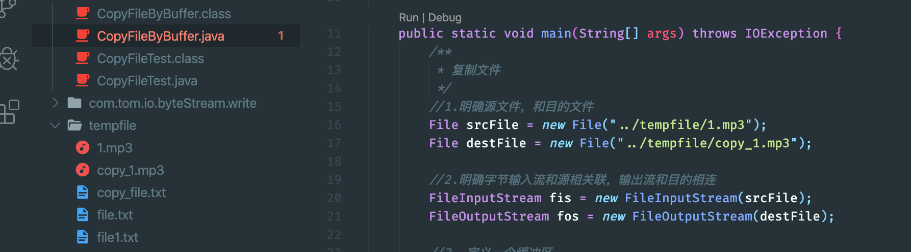
---

### 同时，我们也可以用非缓冲模式，进行复制，利用前面提到的方法
```java
//复制 .mp3
import java.io.File;
import java.io.FileInputStream;
import java.io.FileOutputStream;
import java.io.IOException;

/**
 * CopyFileTest
 */
public class CopyFileTest {

    public static void main(String[] args) throws IOException {
        /**
         * 复制文件
         */
        //1.明确源文件，和目的文件
        File srcFile = new File("../tempfile/1.mp3");
        File destFile = new File("../tempfile/copy_2.mp3");

        //2.明确字节输入流和源相关联，输出流和目的相连
        FileInputStream fis = new FileInputStream(srcFile);
        FileOutputStream fos = new FileOutputStream(destFile);

        //3. 使用输入流的读取方法读取字节，并将字节写入到目的中
        int ch=0;
        while((ch=fis.read())!=-1){
            fos.write(ch);
        }

        //4.close
        fos.close();
        fis.close();
    }
}
```
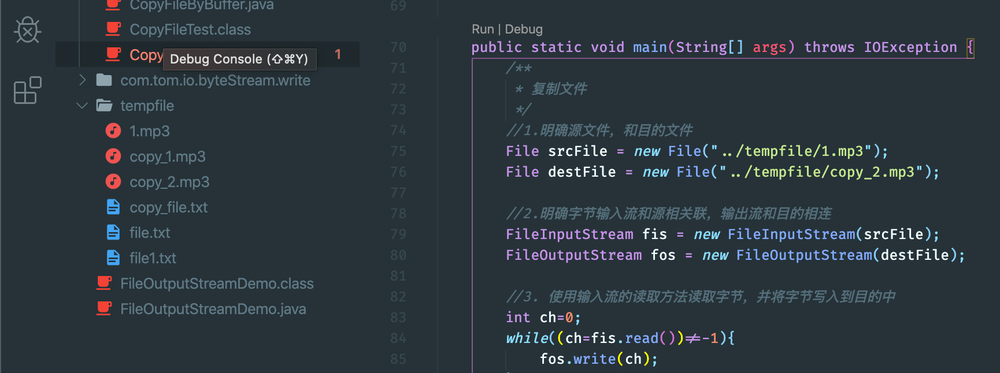


