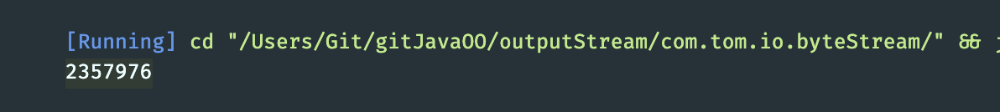
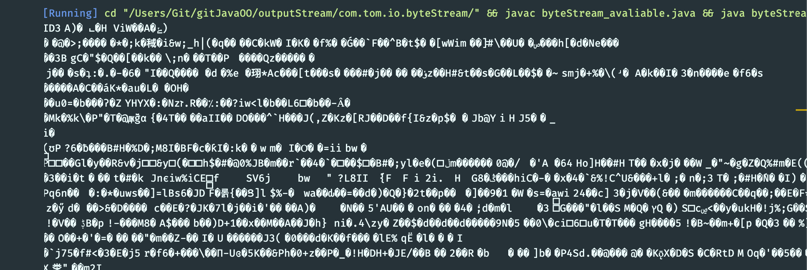
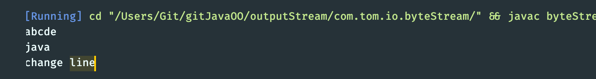
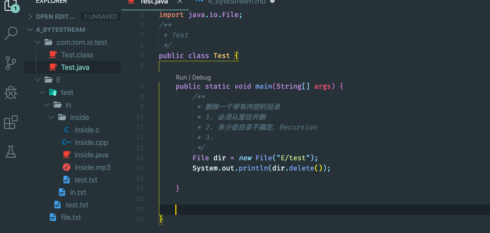
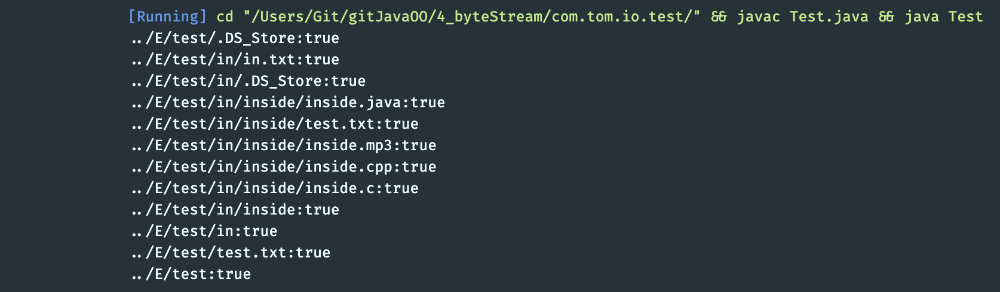
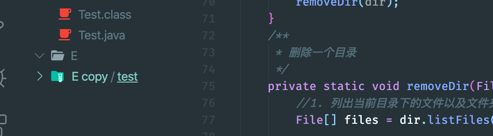
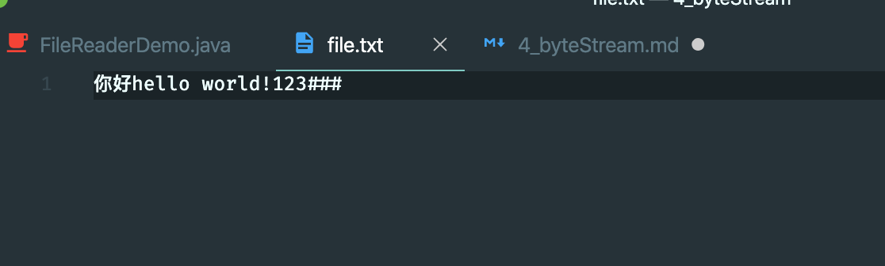
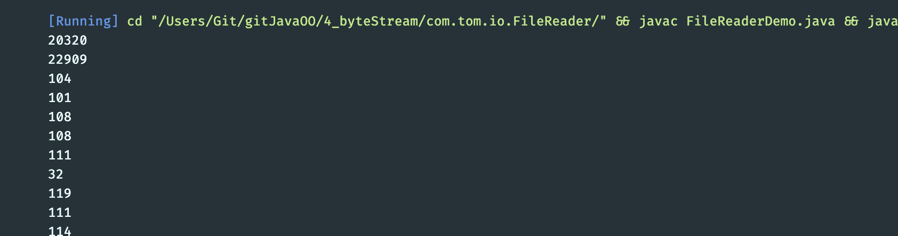
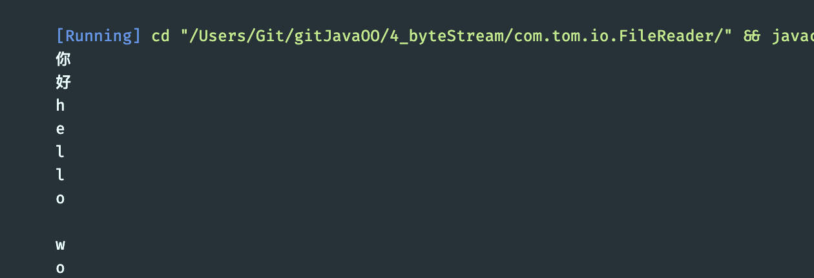

## available()
- Returns an estimate of the number of remaining bytes that can be read
```java
import java.io.FileInputStream;
import java.io.IOException;

/**
 * byteStream_avaliable
 */
public class byteStream_avaliable {

    public static void main(String[] args) throws IOException {
        /**
         * available()
         */
        FileInputStream fis = new FileInputStream("../tempfile/1.mp3");
        //Returns an estimate of the number of remaining bytes that can be read
        System.out.println(fis.available());

        fis.close();
    }
}
```

---
-
```java
    public static void main(String[] args) throws IOException {
        /**
         * available()
         */
        FileInputStream fis = new FileInputStream("../tempfile/1.mp3");
        //Returns an estimate of the number of remaining bytes that can be read
        // System.out.println(fis.available());

        byte[] buf = new byte[fis.available()]; //定义了一个刚刚好的数组. 注意：如果文件过大，容易溢出
                                                //建议缓冲区长度还是1024 整数倍
        String str = new String(buf);
        System.out.println(str);
        fis.close();
    }
```

- `FileInputStream fis = new FileInputStream("../tempfile/file.txt");`

---


### 删除一个带有内容的目录
- first create some files for testing:

- 主要思路： 是目录就递归，不是全删除
```java
import java.io.File;
/**
 * Test
 */
public class Test {

    public static void main(String[] args) {
        /**
         * 删除一个带有内容的目录
         * 1. 必须从里往外删
         * 2. 多少级目录不确定，Recursion
         * 3. 
         */
        File dir = new File("../E/test");
        // System.out.println(dir.delete());

        removeDir(dir);
    }
    /**
     * 删除一个目录
     */
    private static void removeDir(File dir) {
        //1. 列出当前目录下的文件以及文件夹file[]
        File[] files = dir.listFiles();

        for(File file: files){
            //2. 对遍历的对象进行判断是否是目录
            if(file.isDirectory()){
                removeDir(file);
            }else{
                System.out.println(file + ":"+file.delete());
            }
        }
        System.out.println(dir+":"+dir.delete());
    }
}
```


---

### charstream 字符流


### FileReader
- 第一种方法：
```java
import java.io.FileReader;
import java.io.IOException;

/**
 * FileReaderDemo
 * 
 * java.io.Reader: 字符输入流，是字符输入流的最顶层的superclass, 定义了一些共性的成员方法，是一个抽象类
 * 
 * 共性的成员方法：
 * int read() ，读取单个字符并返回
 * int read(char[] chuf) 一次读取多个字符，将字符读入数组
 * void close() 关闭
 * 
 * java.io.FileReader extends InputStreamReader extends Reader
 * FileReader: 文件字符输入流
 * 作用：把硬盘文件中的数据以字符的方式读取到内存中
 * 
 * constructor:
 * FileReader(String filename)
 * FileReader(File file)     
 * param: 读取文件的数据源
 *      String filename: 文件路径
 *      File file: 一个文件
 * FileReader constructor的作用：
 *      1. 创建一个FileReader object
 *      2. 会把FileReader对象指向要读取的文件
 * 
 * 字符输入流的使用步骤：
 *      1. create FileReader object, constructor方法中绑定要读取的数据源
 *      2. 使用filereader object中的方法read()读取文件
 *      3. close（）
 */
public class FileReaderDemo {

    public static void main(String[] args) throws IOException {
        //create FileReader object,
        FileReader fr = new FileReader("../tempfile/file.txt");
        int len = 0;
        while((len = fr.read()) != -1){
            System.out.println(len);
        }
        fr.close();
    }
}
```


- update
```java
    public static void main(String[] args) throws IOException {
        //create FileReader object,
        FileReader fr = new FileReader("../tempfile/file.txt");
        int len = 0;
        while((len = fr.read()) != -1){
            System.out.println((char)len);
        }
        fr.close();
    }
```

-
- 2nd way
```java
//int read(char[] chuf) 一次读取多个字符，将字符读入数组
public class FileReaderDemo {

    public static void main(String[] args) throws IOException {
        //create FileReader object,
        FileReader fr = new FileReader("../tempfile/file.txt");

        //int read(char[] chuf) 一次读取多个字符，将字符读入数组
        char [] cs = new char[1024];//分配1024的倍数，存储读取到的多个字符
        int len = 0;//记录的是每次读取的有效字符个数
        while((len = fr.read(cs))!=-1){

            System.out.println(new String(cs, 0, len));
        }

        fr.close();
    }
}
```
- same result