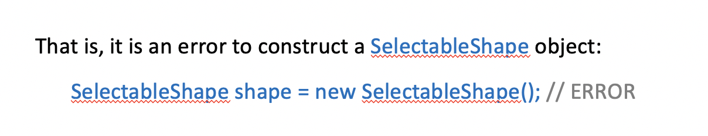

### Abstract Classes

- assume the interface type:

---
- We'll then define classes CarShape and HouseShape that implement this interface type
- Because every shape needs to keep a selection flag, the naive approach would be to supply the selection flag separately in each class:

---
- Clearly, it is a better idea to design a class that expresses this commonality
- We will call this class SelectableShape

---

---
- However, there is a problem with the `SelectableShape` class. It does not define all of the methods of the `SceneShape` interface type. 
- Four methods are left undefined in this class
```java
void draw(Graphics2D g2)
void drawSelection(Graphics2D g2)
void translate(double dx , double dy)
boolean contains(Point2D aPoint)
```
- We say that these methods are undefined or abstract in the `SelectableShape` class
- It is the job of further subclasses to define them
- For that reason, the `SelectableShape` class must be tagged as `abstract`:
```java
public abstract class SelectableShape implements SceneShape {

}
```
- The `HouseShape` and `CarShape` classes are `concrete subclasses` that define the remaining methods
- `Abstract classes` are convenient placeholders for **factoring out common behavior**
- They behave exactly the same as any other classes, with a single exception: **You cannot instantiate an abstract class**

- However, having variables whose type is an abstract class is legal
- Naturally, they **must contain a reference to an object of a concrete subclass (or null)**:
```java
SelectableShape shape = new HouseShape(); // OK
```


