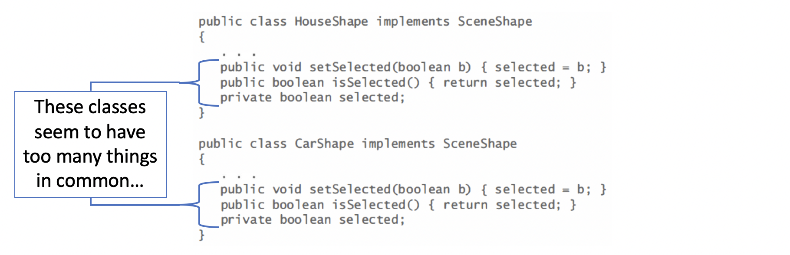
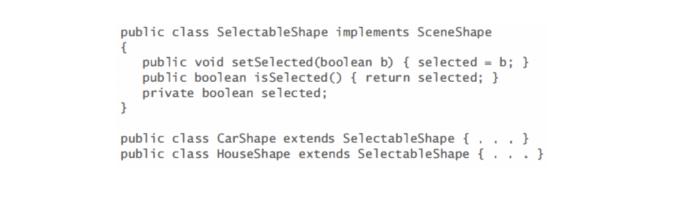
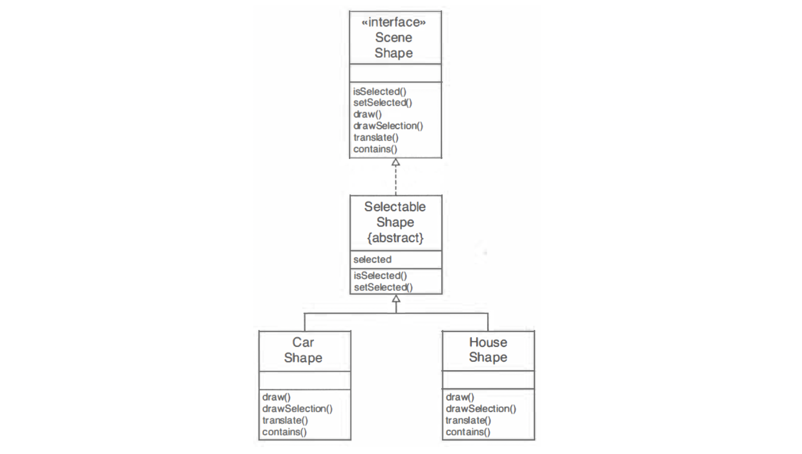

### Abstract Classes

- assume the interface type:

---
- We'll then define classes CarShape and HouseShape that implement this interface type
- Because every shape needs to keep a selection flag, the naive approach would be to supply the selection flag separately in each class:

---
- Clearly, it is a better idea to design a class that expresses this commonality
- We will call this class SelectableShape

---

---
- However, there is a problem with the `SelectableShape` class. It does not define all of the methods of the `SceneShape` interface type. 
- Four methods are left undefined in this class
```java
void draw(Graphics2D g2)
void drawSelection(Graphics2D g2)
void translate(double dx , double dy)
boolean contains(Point2D aPoint)
```

