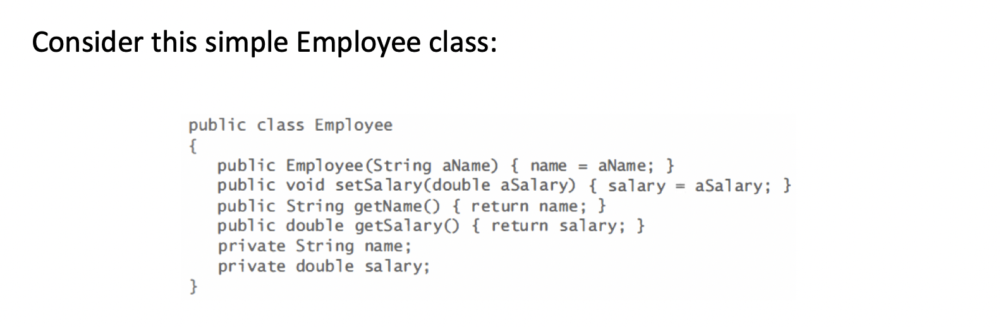
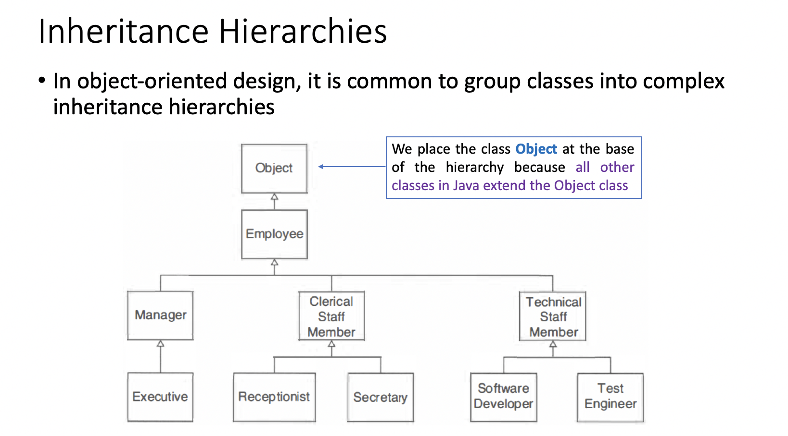

### The Concept of Inheritance
- Generally, the subclass extends the capabilities of the superclass 
    - The specialized subclass objects may have additional methods and fields

---

### Note:
- If a method is tagged as `final`, it cannot be overridden in a subclass
This is useful for particularly sensitive methods (such as security checks)
- It is also possible to declare a class as `final` A `final class` cannot be extended For example, the `String` class is a `final class`

