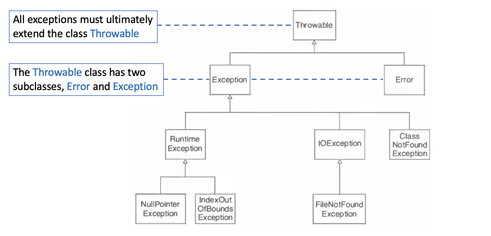
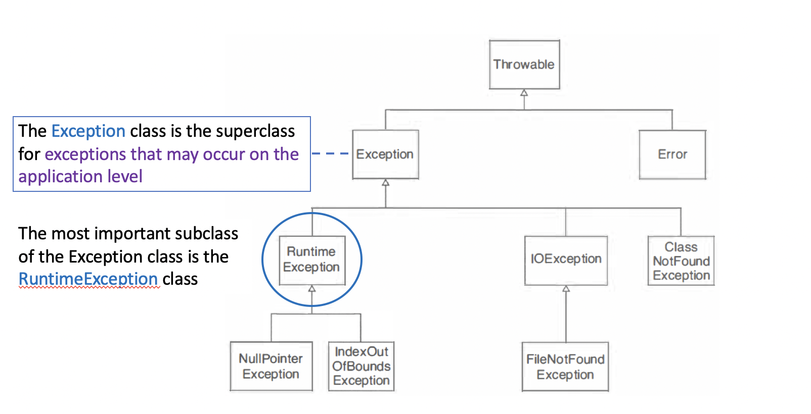
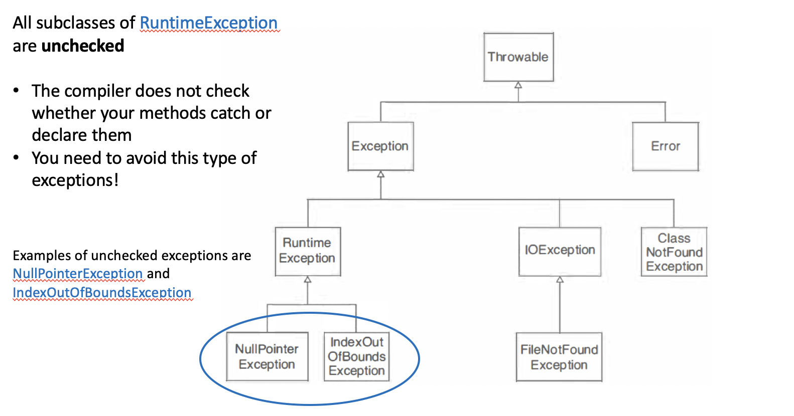
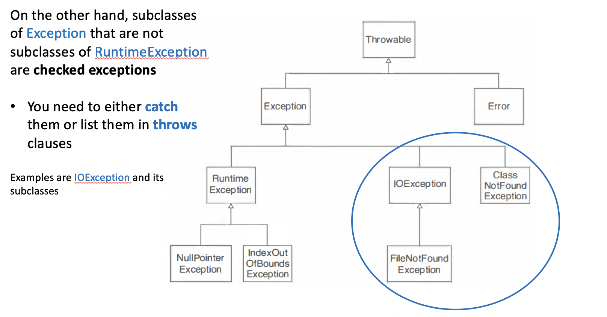
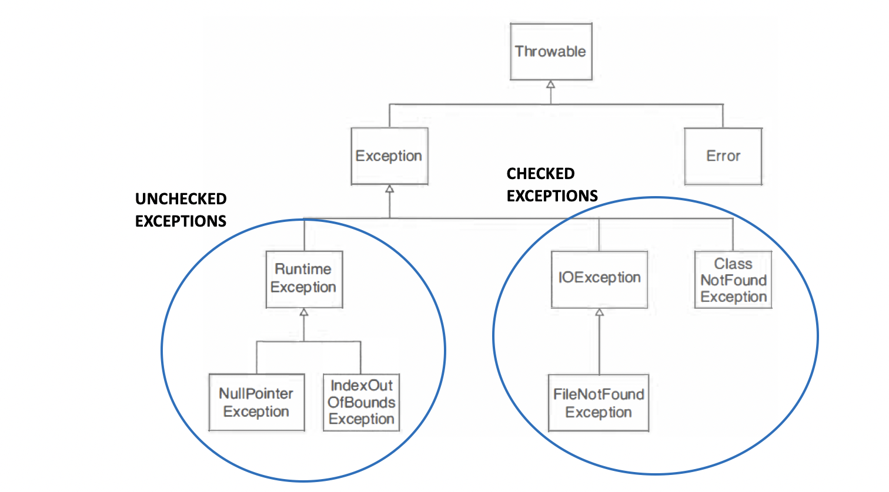
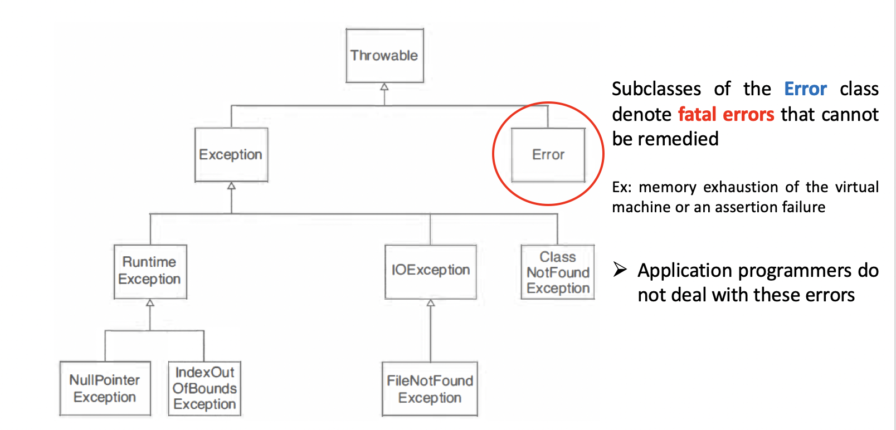
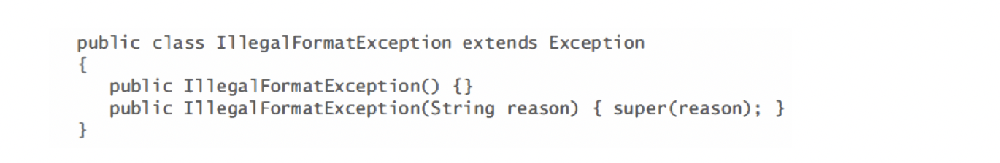
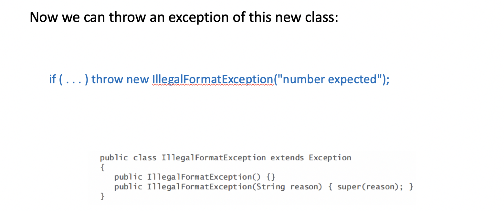

### The Hierarchy of Exception Classes
- The Java library uses inheritance to categorize a large number of exception classes

---

---
- All subclasses of RuntimeException are **unchecked**
    - The compiler does not check whether your methods catch or declare them
    - You need to avoid this type of exceptions!

---

---

---

---


### Standard library or brand new? 
- When you encounter an error condition in your code, and you want to throw an exception, then you need to make a **decision** whether to **use an exception class in the standard library**, or whether to **design your own exception class** 
- If you design your own class, you first need to decide whether the exception should be `checked` or `unchecked`
- `Unchecked` exceptions must be subclasses of **RuntimeException**
---

- When you design an exception class, you should provide 2 constructors: 
    1. A `default constructor`
    2. A `constructor` with a `string parameter` that signifies the reason for the exception
        - This constructor should simply pass the reason string to the superclass constructor
---
- Example: You want to throw an `IIIegalFormatException` when a user enters information in the wrong format
    - Since user actions are beyond the control of the programmer, we design a `checked exception`
    - We inherit from the `Exception` class but not from `RuntimeException`

---

---

### Assignment
- Start with the following class.
```java
public class BankAccount
{
    public void deposit(double amount) { balance += amount; }
    public void withdraw(double amount) { balance -= amount; }
    public double getBalance() { return balance; }
    private double balance;
} 
```
- Define a subclass `CheckingAccount` with a constructor `CheckingAccount(double initialBalance)` and a method void `deductFees()` that deducts the fees and resets the transaction count:
    - A checking account is just like a bank account, except that there is a service charge for deposits and withdrawals 
    - Each month, the first five transactions are free 
    - All further transactions cost $1 
- You will also need to redefine the `deposit` and `withdraw` methods
- Form subclasses `HourlyEmployee` and `SalariedEmployee` of the `Employee` class.
- Provide constructors:
```java
HourlyEmployee(String aName, double anHourlySalary)
SalariedEmployee(String aName, double anAnnualSalary)
```
- Add a method `getWeeklySalary`
- Assume that hourly employees work 40 hours per week, and that salaried employees are paid 1/52 of their annual salary every week.


