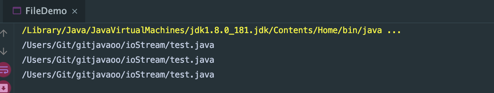
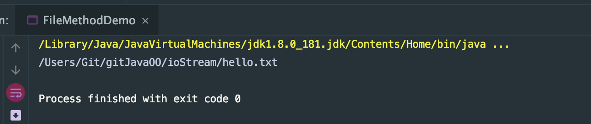

```java
import java.io.File;
public class FileDemo {

    public static void main(String[] args) {
        String pathName = "/Users/Git/gitjavaoo/ioStream/test.java";
        File file = new File(pathName);//将test文件，封装成file对象
        System.out.println(file);

        File f2 = new File("/Users/Git/gitjavaoo/ioStream/", "test.java");
        System.out.println(f2);

        //将parent封装成file object
        File dir = new File("/Users/Git/gitjavaoo/ioStream/");
        File f3 = new File(dir, "test.java");
        System.out.println(f3);

    }
}
```

- **Notice, if a file doesn't exist, the system will create a new file for you** 
---

## file method get()
```java
import java.io.File;

public class FileMethodDemo {

    public static void main(String[] args) {
        /*
        get the info, name, size, time of a file
         */
        File file = new File("hello.txt");
        System.out.println(file.getAbsolutePath());
    }
}
```

