```java
import java.io.File;
public class FileDemo {

    public static void main(String[] args) {
        String pathName = "/Users/Git/gitjavaoo/ioStream/test.java";
        File file = new File(pathName);//将test文件，封装成file对象
        System.out.println(file);

        File f2 = new File("/Users/Git/gitjavaoo/ioStream/", "test.java");
        System.out.println(f2);

        //将parent封装成file object
        File dir = new File("/Users/Git/gitjavaoo/ioStream/");
        File f3 = new File(dir, "test.java");
        System.out.println(f3);

    }
}
```

- **Notice, if a file doesn't exist, the system will create a new file for you** 
---

## file method get()
```java
import java.io.File;

public class FileMethodDemo {

    public static void main(String[] args) {
        /*
        get the info, name, size, time of a file
         */
        File file = new File("hello.txt");
        System.out.println(file.getAbsolutePath());
    }
}
```

---

```java
import java.io.File;
import java.text.DateFormat;
import java.util.Date;

public class FileMethodDemo {

    public static void main(String[] args) {
        //get the info, name, size, time of a file

//        File file = new File("/Users/Git/gitjavaoo/ioStream/src/test.java");
        File file = new File("src/test.java");

        String absPath = file.getAbsolutePath();
        String path = file.getPath();//相对路径
        String fileName = file.getName();

        long size = file.length();
        long time = file.lastModified();

        System.out.println("Absolute Path: " + absPath);
        System.out.println("path: " + path);
        System.out.println("fileName: " + fileName);
        System.out.println("size: " + size);
        System.out.println("time: " + time);

        //convert millisecond to second
        String str_date = DateFormat.getDateTimeInstance(DateFormat.LONG, DateFormat.LONG).format(new Date(time));
        System.out.println(str_date);
    }
}
```
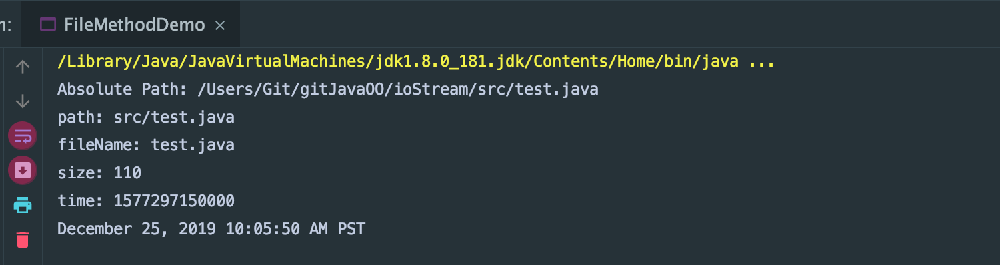
---

## File class, file and folder
```java
public class FileMethodDemo2 {
    public static void main(String[] args) throws IOException {
        //file and folder
       File file = new File("src/file.txt");

       boolean b1 = file.createNewFile();
       System.out.println("b1 = " + b1);

       boolean b2 = file.delete();
       System.out.println("b2 = " + b2);

    }
}
```
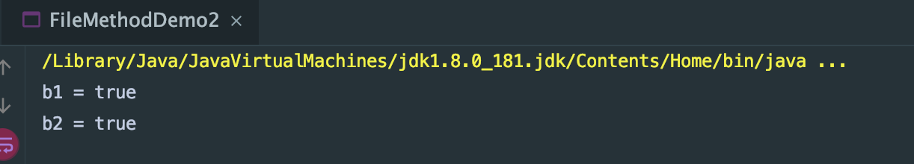
---

```java
public class FileMethodDemo2 {
    public static void main(String[] args) throws IOException {
        //file and folder

        File file = new File("src/file.txt");
        file.createNewFile();

        boolean b3 = file.exists();
        System.out.println(b3);
    }
}
```
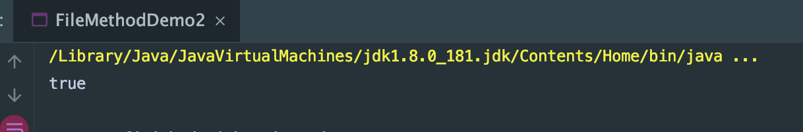
---

```java
        //对目录操作创建，删除，判断
        File dir = new File("src/abc");
        boolean b4 = dir.mkdir();
        System.out.println("b4 = " + b4);
```
- output: true
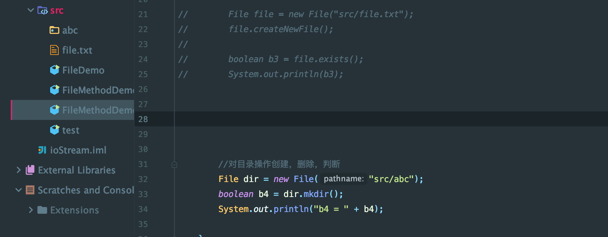
---

```java
        //创建多级目录
        File dir = new File("src/abc/def/ghj/klm/nop");
        boolean b5 = dir.mkdirs();////创建多级目录
        System.out.println("b5 = " + b5);

```
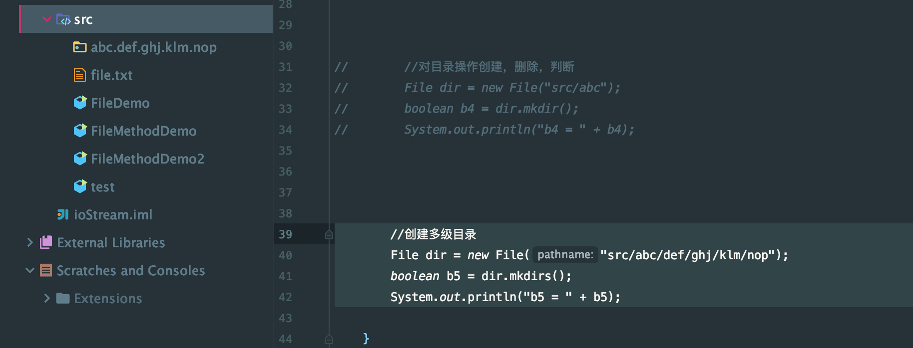
---

```java
        //创建多级目录
        File dir = new File("src/abc/def/ghj/klm/nop");
        boolean b5 = dir.mkdirs();//创建多级目录
        System.out.println("b5 = " + b5);

        boolean b6 = dir.delete();//删除目录时，如果目录中有内容，无法直接删除。只有将目录中的内容都删除后，
        //保证该目录为空，这时这个目录才可以删除
        System.out.println("b6 = " + b6);
```
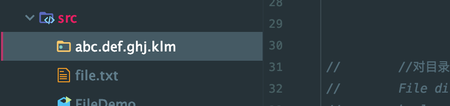
- 这里必须注意：只有删除里面的内容，利用递归，才可以完全删除
- 在windows, 是用c++ 封装了删除，从里往外删除，为了方便用户
---

### 在判断一个文件，必须保证其是存在的
```java
        System.out.println("***********************************");
        File f = new File("src/java.txt");
        System.out.println(f.isFile());
        System.out.println(f.isDirectory());
```
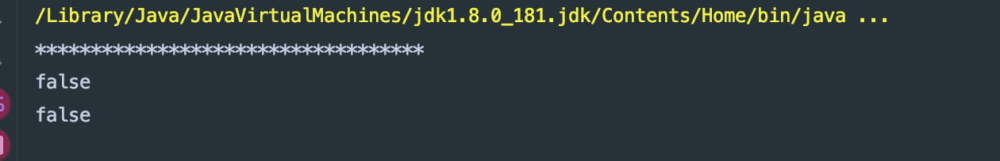
- 所以必须先创建
- update 
```java
       System.out.println("***********************************");
       File f = new File("src/java.txt");
       f.createNewFile();
       System.out.println(f.isFile());
       System.out.println(f.isDirectory());
```
---

## listFiles() 
```java
import java.io.File;

public class FileMethodDemo3 {
    public static void main(String[] args) {
        //对给定的目录，获取内部的内容
        File dir = new File("/Users/Git/gitjavaoo/ioStream/");

        String[] names = dir.list();//获取的是目录下的当前文件以及文件夹names
        for (String name : names) {
            System.out.println(name);
        }
    }
}
```
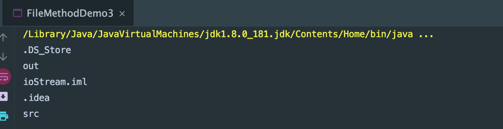
---

```java
        File[] files = dir.listFiles();//获取目录下的当前文件以及文件夹的对象
        for (File file : files) {
            System.out.println(file.lastModified());
        }
```
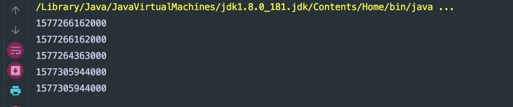
---


## File class, filter过滤器
```java
import java.io.File;

public class FileMethodDemo4 {
    public static void main(String[] args) {
        //获取目录中的内容，但是只要java文件
        File dir = new File("src/");

        File[] files = dir.listFiles();
        for (File file : files) {
            System.out.println(file.getName());
        }
    }
}
/* 
file.txt
abc
java.txt
.DS_Store
FileMethodDemo4.java
test.java
FileDemo.java
FileMethodDemo.java
FileMethodDemo2.java
FileMethodDemo3.java
 */
```
-
- 假如希望只要.java后缀名
```java
        //获取目录中的内容，但是只要java文件
        File dir = new File("src/");

        File[] files = dir.listFiles();
        for (File file : files) {
            if (file.getName().endsWith(".java")) {
                System.out.println(file.getName());
            }
        }

/* 
FileMethodDemo4.java
test.java
FileDemo.java
FileMethodDemo.java
FileMethodDemo2.java
FileMethodDemo3.java
 */        
```
- but the problem is: the codes are hard codes
- 
- create a new package
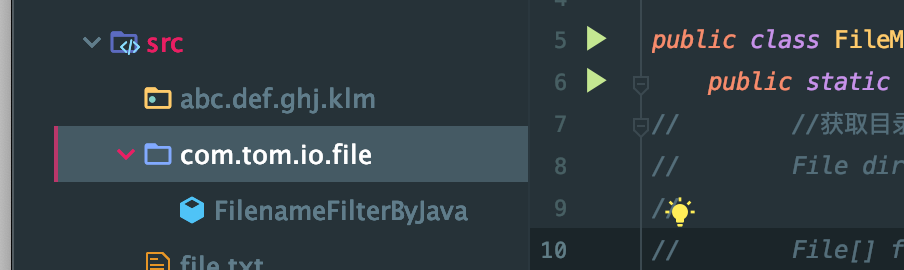
```java
package com.tom.io.file;
import java.io.File;
import java.io.FilenameFilter;

public class FilenameFilterByJava implements FilenameFilter {

    @Override
    public boolean accept(File dir, String name) {
        return name.endsWith(".java");
    }
}
```
- FilenameFilterByJava override accept() method
- update FileMethodDemo4.java
```java
import com.tom.io.file.FilenameFilterByJava;

import java.io.File;

public class FileMethodDemo4 {
    public static void main(String[] args) {

        //获取目录中的内容，但是只要java文件
        File dir = new File("src/");

        File[] files = dir.listFiles(new FilenameFilterByJava());

/* listFiles源码
        public File[] listFiles(FilenameFilter filter) {
            String ss[] = list();
            if (ss == null) return null;
            ArrayList<File> files = new ArrayList<>();
            for (String s : ss)
                if ((filter == null) || filter.accept(this, s))
                    files.add(new File(s, this));
            return files.toArray(new File[files.size()]);
        }
*/        
        for (File file : files) {
            System.out.println(file.getName());
        }
    }
}
```
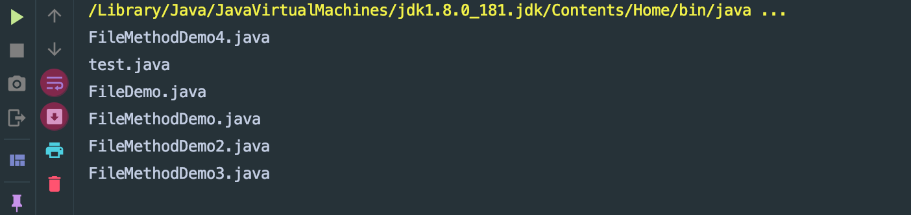
---

## refactoring codes, 2nd way to implement filter
- create a class `FilenameFilterBySuffix`
```java
package com.tom.io.file;

import java.io.File;
import java.io.FilenameFilter;

public class FilenameFilterBySuffix implements FilenameFilter{
    private String suffix;

    public FilenameFilterBySuffix(String suffix) {
        super();
        this.suffix = suffix;
    }

    @Override
    public boolean accept(File dir, String name) {
        return name.endsWith(suffix);
    }
}
```
-
```java

import com.tom.io.file.FilenameFilterBySuffix;

import java.io.File;

public class FileMethodDemo04 {
    public static void main(String[] args) {
        //获取目录中的内容，但是只要java文件
        File dir = new File("src/");

        File[] files = dir.listFiles(new FilenameFilterBySuffix(".txt"));
/* listFiles源码
        public File[] listFiles(FilenameFilter filter) {
            String ss[] = list();
            if (ss == null) return null;
            ArrayList<File> files = new ArrayList<>();
            for (String s : ss)
                if ((filter == null) || filter.accept(this, s))
                    files.add(new File(s, this));
            return files.toArray(new File[files.size()]);
        }
*/

        for (File file : files) {
            System.out.println(file.getName());
        }
    }
}
```
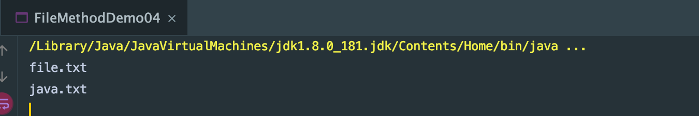
---

### 过滤📁的过滤器
- create a class
```java
package com.tom.io.file;
import java.io.File;
import java.io.FileFilter;

/**
 * 过滤📁的过滤器
 */
public class FileFilterByDiretory implements FileFilter {
    @Override
    public boolean accept(File pathname) {
        return pathname.isDirectory();
    }
}
```
- implements interface `FileFilter`
- override `accept` method, which check if it is directory
-
- create a class FileMethodDemo5 to filter out all directories
```java
import com.tom.io.file.FileFilterByDiretory;
import java.io.File;
public class FileMethodDemo5 {
    public static void main(String[] args) {
        File dir = new File("src/");

        File[] files = dir.listFiles(new FileFilterByDiretory());

        for (File file : files) {
            System.out.println(file);
        }
    }
}
```
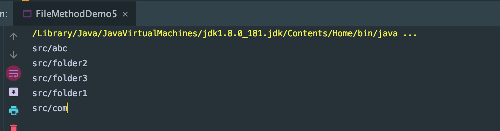
---

### get the content from all subdirectories
```java
package com.tom.io.file;
import java.io.File;
public class FileTest {
    public static void main(String[] args) {
        /*
         *file类的listFiles() 列出当前目录下文件以及文件夹
         *列出当前目录下的子目录中的所有内容
         *
         * 1。 在遍历当前目录时，会获取当前所有文件以及文件夹
         * 2。 要遍历子目录需要对获取到的当前的file对象进行判断，只有是目录才可以作为子目录继续遍历
         */
        File dir = new File("/Users/Git/gitjavaoo/ioStream1/");
        listAll(dir);
    }

    private static void listAll(File dir) {
        File[] files = dir.listFiles();
        for (File file : files) {
            if (file.isDirectory()) {//if current file is directory, continue traversing
                listAll(file);
            }
            System.out.println(file.getName());
        }
    }
}
```
