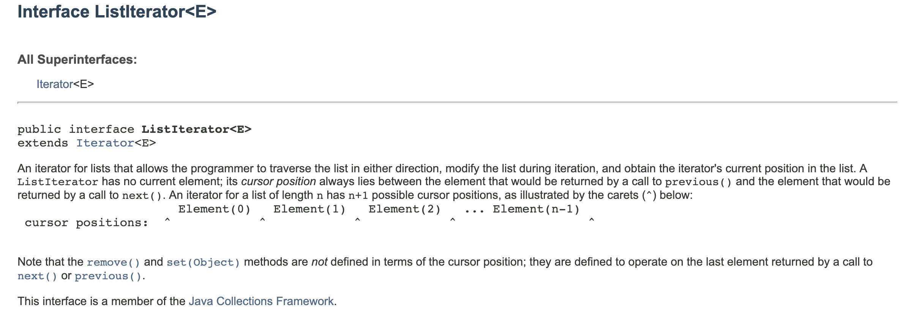

# LinkedList

```java
public class Customer {
    private String name;
    private double balance;

    public Customer(String name, double balance) {
        this.name = name;
        this.balance = balance;
    }

    public void setName(String name) {
        this.name = name;
    }

    public void setBalance(double balance) {
        this.balance = balance;
    }

    public String getName() {
        return name;
    }

    public double getBalance() {
        return balance;
    }
}

public class Main {
    public static void main(String[] args) {
        Customer customer = new Customer("Tim", 54.96);
        Customer anotherCustomer;
        anotherCustomer = customer;
        anotherCustomer.setBalance(12.18);
        System.out.println("Balance for customer" + customer.getName() + " is " + customer.getBalance());
    }
}


//output:
Balance for customerTim is 12.18
```

`anotherCustomer = customer, what we were doing internally, Java was actually assigning the second customer class to point to the first calss. So in other words it just saved the memory address. It didn't create a separate class.`

`Consequently, when we use the setBalance method on the second class, it actually updated the first class.`

## Why we talking about this?
- what the linkedlist is
- the advantages
- over an array

`basic ArrayList`
```java
public class Main {
    public static void main(String[] args) {
        Customer customer = new Customer("Tim", 54.96);
        Customer anotherCustomer;
        anotherCustomer = customer;
        anotherCustomer.setBalance(12.18);
        System.out.println("Balance for customer" + customer.getName() + " is " + customer.getBalance());
        
        ArrayList<Integer> intlist = new ArrayList<>();
        
        intlist.add(1);
        intlist.add(3);
        intlist.add(4);
        
        for(int i=0; i<intlist.size(); i++){
            System.out.println(i + ": "+intlist.get(i));
        }
        System.out.println();
        
        intlist.add(1, 2);
        
        for(int i=0; i<intlist.size(); i++){
            System.out.println(i + ": "+intlist.get(i));
        }
    }
}

//output:
0: 1
1: 3
2: 4

0: 1
1: 2
2: 3
3: 4
```

`iterator()`

```java
public class Demo {
    public static void main(String[] args) {
        LinkedList<String> placesToVisit = new LinkedList<>();
        placesToVisit.add("Sydney");
        placesToVisit.add("Melbourne");
        placesToVisit.add("Brisbane");
        placesToVisit.add("Perth");
        placesToVisit.add("Canberra");
        placesToVisit.add("Adelaide");
        placesToVisit.add("Darwin");

        printList(placesToVisit);
        placesToVisit.add(1, "Alice Spring");
        printList(placesToVisit);

        placesToVisit.remove(4);
        printList(placesToVisit);
    }

    private static void printList(LinkedList<String> linkedList) {
        Iterator<String> i = linkedList.iterator();
        while (i.hasNext()) {
            System.out.println("Now visiting " + i.next());
        }
        System.out.println("=========================");
    }
}


//output:
Now visiting Sydney
Now visiting Melbourne
Now visiting Brisbane
Now visiting Perth
Now visiting Canberra
Now visiting Adelaide
Now visiting Darwin
=========================
Now visiting Sydney
Now visiting Alice Spring
Now visiting Melbourne
Now visiting Brisbane
Now visiting Perth
Now visiting Canberra
Now visiting Adelaide
Now visiting Darwin
=========================
Now visiting Sydney
Now visiting Alice Spring
Now visiting Melbourne
Now visiting Brisbane
Now visiting Canberra
Now visiting Adelaide
Now visiting Darwin
=========================
```


# traversal the ListIterator()
```java
public class Demo {
    public static void main(String[] args) {
        LinkedList<String> placesToVisit = new LinkedList<>();
        addInOrder(placesToVisit, "Sydney");
        addInOrder(placesToVisit, "Melbourne");
        addInOrder(placesToVisit, "Brisbane");
        addInOrder(placesToVisit, "Perth");
        addInOrder(placesToVisit, "Canberra");
        addInOrder(placesToVisit, "Adelaide");
        addInOrder(placesToVisit, "Darwin");

        printList(placesToVisit);
        addInOrder(placesToVisit, "Alice Springs");
        addInOrder(placesToVisit, "Darwin");
        printList(placesToVisit);
        visit(placesToVisit);
    }

    private static void printList(LinkedList<String> linkedList) {
        Iterator<String> i = linkedList.iterator();
        while (i.hasNext()) {
            System.out.println("Now visiting " + i.next());
        }
        System.out.println("=========================");
    }

    private static boolean addInOrder(LinkedList<String> linkedList, String newCity) {
        ListIterator<String> stringListIterator = linkedList.listIterator();
        while (stringListIterator.hasNext()) {
            int comparison = stringListIterator.next().compareTo(newCity);
            if (comparison == 0) {
                //equal, don't add
                System.out.println(newCity + " is already included as a destination");
                return false;
            } else if (comparison > 0) {
                //new City should appear before this one
                //Brisban -> Adelaide
                stringListIterator.previous();
                stringListIterator.add(newCity);
                return true;
            } else if (comparison < 0) {
                //move on next city
            }
        }
        stringListIterator.add(newCity);
        return true;
    }

    private static void visit(LinkedList cities) {
        Scanner scanner = new Scanner(System.in);
        boolean quit = false;
        boolean goingForward = true;
        ListIterator<String> listIterator = cities.listIterator();
        if (cities.isEmpty()) {
            System.out.println("No cities in the itenerary");
            return;
        } else {
            System.out.println("Now visiting" + listIterator.next());
            printMenu();
        }
        while (!quit) {
            int action = scanner.nextInt();
            scanner.nextLine();
            switch (action) {
                case 0:
                    System.out.println("Holiday (vacation) over");
                    quit = true;
                    break;
                case 1:
                    if(!goingForward){ //solve iterator's move to previous 
                        if(listIterator.hasNext()){
                            listIterator.next();
                        }
                        goingForward = true;
                    }
                    if (listIterator.hasNext()) {
                        System.out.println("Now visiting " + listIterator.next());
                    } else {
                        System.out.println("Reached the end of the list");
                    }
                    break;
                case 2:
                    if(goingForward){
                        if(listIterator.hasPrevious()){
                            listIterator.previous();
                        }
                        goingForward = false;
                    }
                    if (listIterator.hasPrevious()) {
                        System.out.println("Now visiting " + listIterator.previous());
                    } else {
                        System.out.println("We are at the start of the list");
                    }
                    break;
                case 3:
                    printMenu();
                    break;
            }
        }
    }

    private static void printMenu() {
        System.out.println("Available action:\npress ");
        System.out.println("0 - to quit");
        System.out.println("1 - go to next city");
        System.out.println("2 - go to previous city");
        System.out.println("3 - print menu options");
    }
}


//output:
Now visiting Adelaide
Now visiting Brisbane
Now visiting Canberra
Now visiting Darwin
Now visiting Melbourne
Now visiting Perth
Now visiting Sydney
=========================
Darwin is already included as a destination
Now visiting Adelaide
Now visiting Alice Springs
Now visiting Brisbane
Now visiting Canberra
Now visiting Darwin
Now visiting Melbourne
Now visiting Perth
Now visiting Sydney
=========================
Now visitingAdelaide
Available action:
press 
0 - to quit
1 - go to next city
2 - go to previous city
3 - print menu options
1
Now visiting Alice Springs
1
Now visiting Brisbane
2
Now visiting Brisbane
1
Now visiting Brisbane
2
Now visiting Brisbane
2
Now visiting Alice Springs
2
Now visiting Adelaide
```

- the problem is that there's no current position as such
- so the listIterator actually hovers between the items that would be returned when you go to previous or you go to next 
- if you go forward with one and then you go back with two, then go forward with one etc, you never actually leave the city that you're actually in. 



- so we altering the codes

```java
public class Demo {
    public static void main(String[] args) {
        LinkedList<String> placesToVisit = new LinkedList<>();
        addInOrder(placesToVisit, "Sydney");
        addInOrder(placesToVisit, "Melbourne");
        addInOrder(placesToVisit, "Brisbane");
        addInOrder(placesToVisit, "Perth");
        addInOrder(placesToVisit, "Canberra");
        addInOrder(placesToVisit, "Adelaide");
        addInOrder(placesToVisit, "Darwin");

        printList(placesToVisit);
        addInOrder(placesToVisit, "Alice Springs");
        addInOrder(placesToVisit, "Darwin");
        printList(placesToVisit);
        visit(placesToVisit);
    }

    private static void printList(LinkedList<String> linkedList) {
        Iterator<String> i = linkedList.iterator();
        while (i.hasNext()) {
            System.out.println("Now visiting " + i.next());
        }
        System.out.println("=========================");
    }

    private static boolean addInOrder(LinkedList<String> linkedList, String newCity) {
        ListIterator<String> stringListIterator = linkedList.listIterator();
        while (stringListIterator.hasNext()) {
            int comparison = stringListIterator.next().compareTo(newCity);
            if (comparison == 0) {
                //equal, don't add
                System.out.println(newCity + " is already included as a destination");
                return false;
            } else if (comparison > 0) {
                //new City should appear before this one
                //Brisban -> Adelaide
                stringListIterator.previous();
                stringListIterator.add(newCity);
                return true;
            } else if (comparison < 0) {
                //move on next city
            }
        }
        stringListIterator.add(newCity);
        return true;
    }

    private static void visit(LinkedList cities) {
        Scanner scanner = new Scanner(System.in);
        boolean quit = false;
        boolean goingForward = true;
        ListIterator<String> listIterator = cities.listIterator();
        if (cities.isEmpty()) {
            System.out.println("No cities in the itenerary");
            return;
        } else {
            System.out.println("Now visiting" + listIterator.next());
            printMenu();
        }
        while (!quit) {
            int action = scanner.nextInt();
            scanner.nextLine();
            switch (action) {
                case 0:
                    System.out.println("Holiday (vacation) over");
                    quit = true;
                    break;
                    
                case 1:
                    if(!goingForward){ //solve iterator's move to previous 
                        if(listIterator.hasNext()){
                            listIterator.next();
                        }
                        goingForward = true;
                    }
                    if (listIterator.hasNext()) {
                        System.out.println("Now visiting " + listIterator.next());
                    } else {
                        System.out.println("Reached the end of the list");
                        goingForward = false;
                    }
                    break;
                    
                case 2:
                    if(goingForward){
                        if(listIterator.hasPrevious()){
                            listIterator.previous();
                        }
                        goingForward = false;
                    }
                    if (listIterator.hasPrevious()) {
                        System.out.println("Now visiting " + listIterator.previous());
                    } else {
                        System.out.println("We are at the start of the list");
                        goingForward = true;
                    }
                    break;
                    
                case 3:
                    printMenu();
                    break;
            }
        }
    }

    private static void printMenu() {
        System.out.println("Available action:\npress ");
        System.out.println("0 - to quit");
        System.out.println("1 - go to next city");
        System.out.println("2 - go to previous city");
        System.out.println("3 - print menu options");
    }
}

//output:
Now visiting Adelaide
Now visiting Brisbane
Now visiting Canberra
Now visiting Darwin
Now visiting Melbourne
Now visiting Perth
Now visiting Sydney
=========================
Darwin is already included as a destination
Now visiting Adelaide
Now visiting Alice Springs
Now visiting Brisbane
Now visiting Canberra
Now visiting Darwin
Now visiting Melbourne
Now visiting Perth
Now visiting Sydney
=========================
Now visitingAdelaide
Available action:
press 
0 - to quit
1 - go to next city
2 - go to previous city
3 - print menu options
1
Now visiting Alice Springs
1
Now visiting Brisbane
2
Now visiting Alice Springs
2
Now visiting Adelaide
2
We are at the start of the list
2
We are at the start of the list
2
We are at the start of the list
1
Now visiting Adelaide
1
Now visiting Alice Springs
1
Now visiting Brisbane
1
Now visiting Canberra
1
Now visiting Darwin
1
Now visiting Melbourne
1
Now visiting Perth
1
Now visiting Sydney
1
Reached the end of the list
1
Reached the end of the list
1
Reached the end of the list
2
Now visiting Sydney
2
Now visiting Perth
2
Now visiting Melbourne
```

