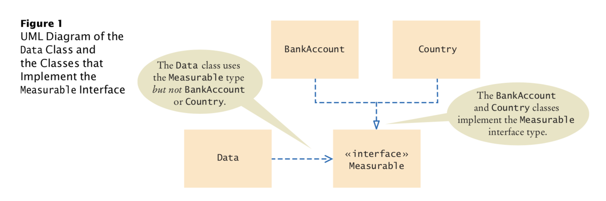

# An interface type is similar to a class, but there are several important differences:
- An interface type doesn't have instance variables
- Methods in an interface must be abstract(that is, without an implementation) 
- All methods in an interface type are automatically public
- An interface type has no constructor. Interface are not classes, and you cannot construct objects of an interface type.


# Implementing an Interface Type:
```java
public class BankAccount implements Measurable
{
        ...
    public double getMeasure()
    {
        return balance;
    } 
}
```
- Once the BankAccount class implements the Measurable interface type, BankAccount objects are instances of the Measurable type:
```java
Measurable obj = new BankAccount();  //OK
```

### further on, the source code in bigjava section_1


---
# A class can implement more than one interface, for example
```java

public class Country implements Measurable, Named

public interface Named {
    String getName(); 
}

```

---
# Constants in Interfaces
- Interfaces cannot have instance variables, but it is legal to specify constants. When declaring a constant in an interface, you can (and should) omit the reserved words public static final, because all variables in an interface are automatically public static final. For example,
```java
public interface Named{
    String NO_NAME = "...";
    ...
}
```

---
# Static Methods in Interfaces
- Before Java 8, all methods in an interface had to be abstract. Java 8 allows static methods in interfaces that work exactly like static methods in classes. A static method of an interface does not operate on objects, and its purpose should relate to the interface that contains it.
```java
public interface Measurable
{
   double getMeasure();  // An abstract method

   static double average(Measurable[] objects) // A static method
   {
      double sum = 0;
      for (Measurable obj : objects)
      {
         sum = sum + obj.getMeasure();
      }
      if (objects.length > 0) { return sum / objects.length; }
      else { return 0; }
   } 
}
/*
To call this method, provide the name of of the interface and the method name: 
 */
double meanArea = Measurable.average(countries);
```

---
# default metonds
### A default method is a non-static method in an interface that has an implementation. A class that implements the method either inherits the default behavior or overrides it. By providing default methods in an interface, it is less work to define a class that implements an interface.
*For example, the Measurable interface can declare getMeasure as a default method:*
```java
public interface Measurable {
    default double getMeasure() { return 0; } 
}

```

---
#  Converting from Classes to Interfaces
- It is legal to convert from the BankAccount type to the Measurable type. In general, you can convert from a class type to the type of any interface that the class implements. For example,
```java

BankAccount account = new BankAccount(1000); 
Measurable meas = account; // OK

```

# Casting from Interfaces to Classes
- Consider this method that returns the object with the larger measure:
```java
public static Measurable larger(Measurable obj1, Measurable obj2) {
    if (obj1.getMeasure() > obj2.getMeasure()) {
        return obj1; 
    }else{
        return obj2;
    }
}

/*
 The larger method returns the object with the larger measure, as a Measurable reference. It has no choice––it does not know the exact type of the object. Let’s use the method:
 */
Country uruguay = new Country("Uruguay", 176220); 
Country thailand = new Country("Thailand", 513120); 
Measurable max = larger(uruguay, thailand); 

/* 
Now what can you do with the max reference? 
You know it refers to a Country object, but the compiler doesn’t. 
For example, you cannot call the getName method:
 */
String countryName = max.getName(); // Error
/*
That call is an error, because the Measurable type has no getName method.
However, as long as you are absolutely sure that max refers to a Country object, 
you can use the cast notation to convert its type back: 
 */
Country maxCountry = (Country) max;
String name = maxCountry.getName();

```

