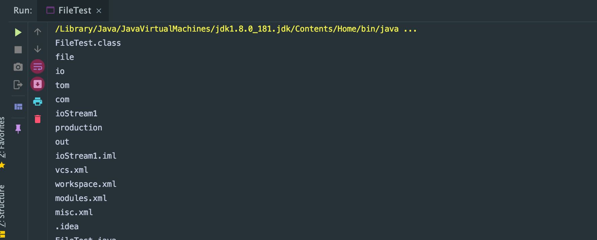
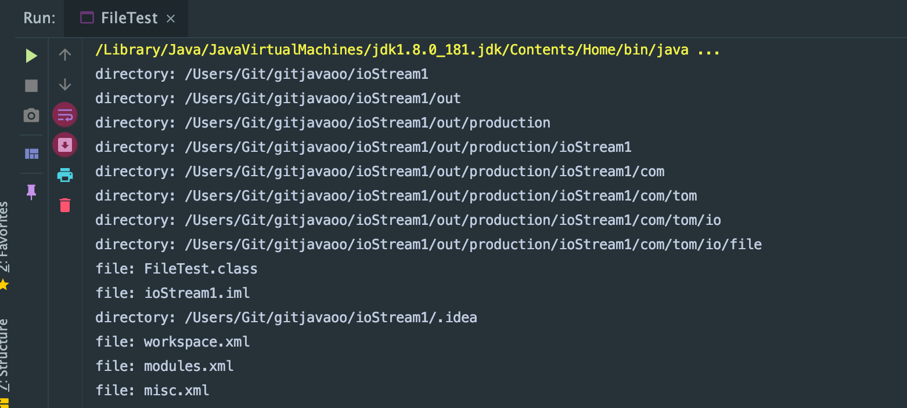
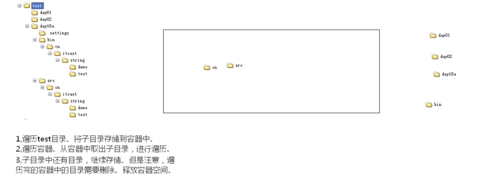
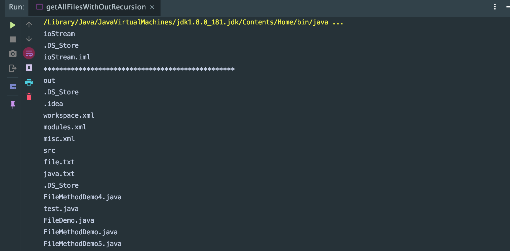

### get the content from all subdirectories by `Recursion`
```java
package com.tom.io.file;
import java.io.File;
public class FileTest {
    public static void main(String[] args) {
        /*
         *file类的listFiles() 列出当前目录下文件以及文件夹
         *列出当前目录下的子目录中的所有内容
         *
         * 1。 在遍历当前目录时，会获取当前所有文件以及文件夹
         * 2。 要遍历子目录需要对获取到的当前的file对象进行判断，只有是目录才可以作为子目录继续遍历
         */
        File dir = new File("/Users/Git/gitjavaoo/ioStream1/");
        listAll(dir);
    }

    private static void listAll(File dir) {
        File[] files = dir.listFiles();
        for (File file : files) {
            if (file.isDirectory()) {//if current file is directory, continue traversing
                listAll(file);
            }
            System.out.println(file.getName());
        }
    }
}
```

---

### refactoring `FileTest`
```java
public class FileTest {
    public static void main(String[] args) {
        /*
         *file类的listFiles() 列出当前目录下文件以及文件夹
         *列出当前目录下的子目录中的所有内容
         *
         * 1。 在遍历当前目录时，会获取当前所有文件以及文件夹
         * 2。 要遍历子目录需要对获取到的当前的file对象进行判断，只有是目录才可以作为子目录继续遍历
         */
        File dir = new File("/Users/Git/gitjavaoo/ioStream1/");
        listAll(dir);
    }

    private static void listAll(File dir) {
        System.out.println("directory: " + dir);
        File[] files = dir.listFiles();
        for (File file : files) {
            if (file.isDirectory()) {//if current file is directory, continue traversing
                listAll(file);
            }else{
                System.out.println("file: " + file.getName());
            }
        }
    }
}
```
- if file is directory, `System.out.println("directory: " + dir);`
- else print `file.getName()`

---

### 遍历📃队列: iterating all files without `Recursion`

-  without recursion:
    1. 可以对每一个目录进行循环，但是目录层级很多，for会死掉
    2. 每遍历到一个目录，不对其进行遍历，而是临时存起来
        相当于把所有目录（无论同级与否）,都储存起来
    3. 遍历容器时取到就是目录，然后对目录遍历即可
    4. 从容器中取到目录遍历时发现内部还有目录，一样将这些目录存储到容器中
    5. 只要不断的遍历这个容器即可
- 通过图解：发现这个容器只要是一个简单的队列就可以解决问题
- 
- create a class Queue
- getAllFilesWithOutRecursion.java
```java
import java.io.File;
import java.util.LinkedList;

public class getAllFilesWithOutRecursion {
    public static void main(String[] args) {
        /*
        without recursion:
        1. 可以对每一个目录进行循环，但是目录层级很多，for会死掉
        2。 每遍历到一个目录，不对其进行遍历，而是临时存起来
            相当于把所有目录（无论同级与否）,都储存起来
        3。 遍历容器时取到就是目录，然后对目录遍历即可
        4. 从容器中取到目录遍历时发现内部还有目录，一样将这些目录存储到容器中
        5. 只要不断的遍历这个容器即可

        通过图解：发现这个容器只要是一个简单的队列就可以解决问题
         */
        File dir = new File("/Users/Git/gitjavaoo/ioStream");
        System.out.println(dir.getName());
        Queue<File> queue = new Queue<File>();
        //1, 对dir 进行当前目录遍历
        File[] files = dir.listFiles();
        for (File file : files) {
            //2. if there is subdirectory, store in Queue
            if (file.isDirectory()) {
                queue.myAdd(file);
            } else {
                System.out.println(file.getName());
            }
        }
        System.out.println("*************************************************");
        //3. Iterating queue, since the subdirectories are all in queue
        while (!queue.isNull()) {
            File subDirectory = queue.myGet();//get the subdirectory from queue
            System.out.println(subDirectory.getName());
            //4. iterating subdirectories
            File[] subFiles = subDirectory.listFiles();
            for (File subFile : subFiles) {
                if (subFile.isDirectory()) {
                    queue.myAdd(subFile);
                } else {
                    System.out.println(subFile.getName());
                }
            }
        }
    }
}

//FIFO
class Queue<E>{
    private LinkedList<E> link;

    public Queue() {
        link = new LinkedList();
    }

    public void myAdd(E obj) {
        link.addFirst(obj);
    }

    public E myGet(){
        return link.removeLast();
    }

    public boolean isNull(){
        return link.isEmpty();
    }
```

---


