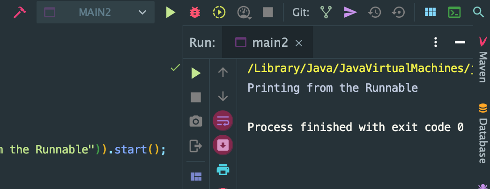
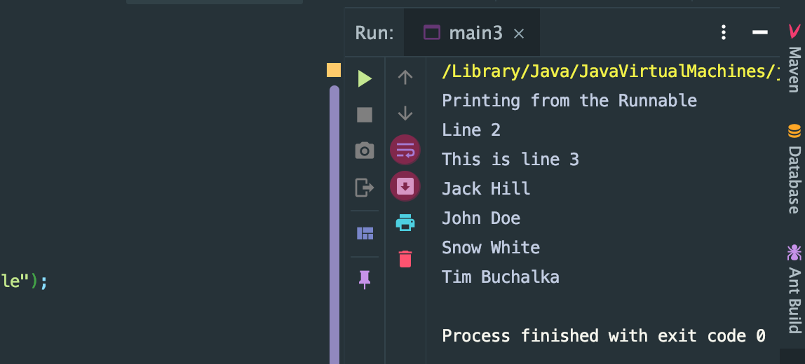
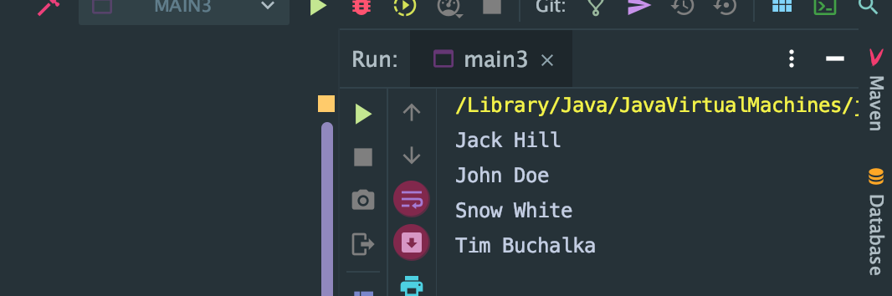
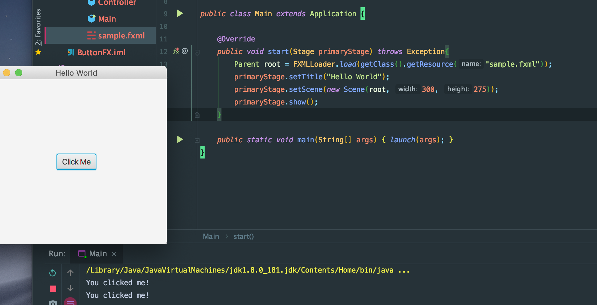
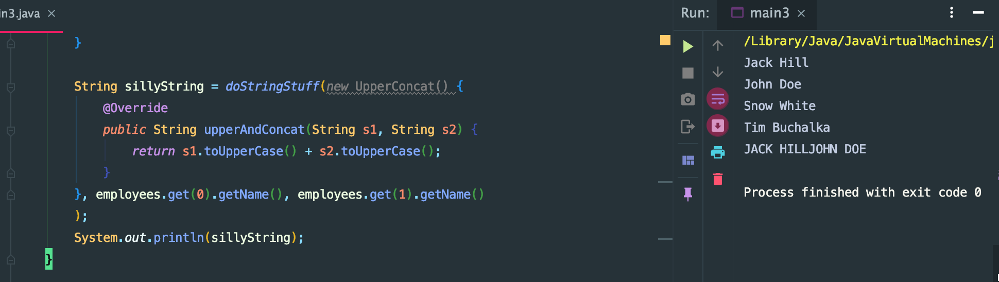

## Introduction

```java
public class Main {
    public static void main(String[] args) {
        new Thread(new Runnable() {
            @Override
            public void run() {
                System.out.println("printing from the Runnable");
            }
        }).start();
    }
}

class CodeToRun implements Runnable{

    /**
     * When an object implementing interface <code>Runnable</code> is used
     * to create a thread, starting the thread causes the object's
     * <code>run</code> method to be called in that separately executing
     * thread.
     * <p>
     * The general contract of the method <code>run</code> is that it may
     * take any action whatsoever.
     *
     * @see Thread#run()
     */
    @Override
    public void run() {
        System.out.println("Printing from the Runnable");
    }
}
```

## Or we can also call the Ruunable
```java
public class main2 {
    public static void main(String[] args) {
        new Thread(()-> System.out.println("Printing from the Runnable")).start();
    }
}
```



### Every lambda expression got three parts
1. argument list
2. arrow token
3. body


- example 3:
```java
public class main3 {
    public static void main(String[] args) {
        new Thread(()->{
            System.out.println("Printing from the Runnable");
            System.out.println("Line 2");
            System.out.format("This is line %d\n", 3);
        }).start();
    }
}
```

## further example:

```java
package introduction;
import java.util.*;

public class main3 {
    public static void main(String[] args) {

        Employee john = new Employee("John Doe", 30);
        Employee tim = new Employee("Tim Buchalka", 21);
        Employee jack = new Employee("Jack Hill", 40);
        Employee snow = new Employee("Snow White", 22);

        List<Employee> employees = new ArrayList<>();
        employees.add(john);
        employees.add(tim);
        employees.add(jack);
        employees.add(snow);

        Collections.sort(employees, new Comparator<Employee>() {
            @Override
            public int compare(Employee o1, Employee o2) {
                return o1.getName().compareTo(o2.getName());
            }
        });

        for (Employee employee : employees) {
            System.out.println(employee.getName());
        }
    }
}

class Employee{
    private String name;
    private int age;

    public Employee(String name, int age) {
        this.name = name;
        this.age = age;
    }

    public void setName(String name) {
        this.name = name;
    }

    public void setAge(int age) {
        this.age = age;
    }

    public String getName() {
        return name;
    }

    public int getAge() {
        return age;
    }
}
```

---


## 
- remember every object contains an `equal` method and that means every instance that implements comparator 
  will already have an implementation of the `equal` method 
- it's a functional interface and we can use lambda instead of an anonymous class 

### improve to lambda

```java
        Collections.sort(employees, (Employee o1, Employee o2)->
                o1.getName().compareTo(o2.getName()));

        for (Employee employee : employees) {
            System.out.println(employee.getName());
        }
```



### Even further
```java
        Collections.sort(employees, (o1, o2)->
                o1.getName().compareTo(o2.getName()));

        for (Employee employee : employees) {
            System.out.println(employee.getName());
        }
```
---


### lambda continued
- create a buttonFX project for javafx

- add a `<Button` to sample.fxml
```xml
<?import javafx.geometry.Insets?>
<?import javafx.scene.layout.GridPane?>
<?import javafx.scene.control.Button?>
<?import javafx.scene.control.Label?>
<GridPane fx:controller="sample.Controller"
          xmlns:fx="http://javafx.com/fxml" alignment="center" hgap="10" vgap="10">
    <Button fx:id="clickMeButton" text="Click Me" GridPane.rowIndex="0" GridPane.columnIndex="0"/>
</GridPane>
```
- update Controller.java
```java
package sample;
import javafx.event.ActionEvent;
import javafx.event.EventHandler;
import javafx.fxml.FXML;
import javafx.scene.control.Button;

public class Controller {
    @FXML
    private Button clickMeButton;

    public void initialize() {
        clickMeButton.setOnAction(new EventHandler<ActionEvent>() {
            @Override
            public void handle(ActionEvent event) {
                System.out.println("You clicked me!");
            }
        });
    }
}
```
- run main class


- improve Controller.java
```java
package sample;
import javafx.event.ActionEvent;
import javafx.event.EventHandler;
import javafx.fxml.FXML;
import javafx.scene.control.Button;


public class Controller {
    @FXML
    private Button clickMeButton;

    public void initialize() {
        clickMeButton.setOnAction(event -> System.out.println("You click me!"));
    }
}
```
- then, the same result
---


### turn to previous example employees:
```java
import java.util.*;

public class main3 {
    public static void main(String[] args) {

        Employee john = new Employee("John Doe", 30);
        Employee tim = new Employee("Tim Buchalka", 21);
        Employee jack = new Employee("Jack Hill", 40);
        Employee snow = new Employee("Snow White", 22);

        List<Employee> employees = new ArrayList<>();
        employees.add(john);
        employees.add(tim);
        employees.add(jack);
        employees.add(snow);

        Collections.sort(employees, (o1, o2)->
                o1.getName().compareTo(o2.getName()));

        for (Employee employee : employees) {
            System.out.println(employee.getName());
        }

        String sillyString = doStringStuff(new UpperConcat() {
            @Override
            public String upperAndConcat(String s1, String s2) {
                return s1.toUpperCase() + s2.toUpperCase();
            }
        }, employees.get(0).getName(), employees.get(1).getName()
        );
        System.out.println(sillyString);
    }

    public final static String doStringStuff(UpperConcat uc, String s1, String s2){
        return uc.upperAndConcat(s1, s2);
    }
}

class Employee{
    private String name;
    private int age;

    public Employee(String name, int age) {
        this.name = name;
        this.age = age;
    }

    public void setName(String name) {
        this.name = name;
    }

    public void setAge(int age) {
        this.age = age;
    }

    public String getName() {
        return name;
    }

    public int getAge() {
        return age;
    }
}

//concat: 合并多个数组
interface UpperConcat{
    public String upperAndConcat(String s1, String s2);
}
```



- improve to lambda

```java
public class main3 {
    public static void main(String[] args) {

        Employee john = new Employee("John Doe", 30);
        Employee tim = new Employee("Tim Buchalka", 21);
        Employee jack = new Employee("Jack Hill", 40);
        Employee snow = new Employee("Snow White", 22);

        List<Employee> employees = new ArrayList<>();
        employees.add(john);
        employees.add(tim);
        employees.add(jack);
        employees.add(snow);

        Collections.sort(employees, (o1, o2)->
                o1.getName().compareTo(o2.getName()));

        for (Employee employee : employees) {
            System.out.println(employee.getName());
        }

        UpperConcat uc = (s1, s2) -> s1.toUpperCase() + s2.toUpperCase();
        String sillyString = doStringStuff(uc, employees.get(0).getName(), employees.get(1).getName());
        System.out.println(sillyString);
    }

    public final static String doStringStuff(UpperConcat uc, String s1, String s2){
        return uc.upperAndConcat(s1, s2);
    }
}

class Employee{
    private String name;
    private int age;

    public Employee(String name, int age) {
        this.name = name;
        this.age = age;
    }

    public void setName(String name) {
        this.name = name;
    }

    public void setAge(int age) {
        this.age = age;
    }

    public String getName() {
        return name;
    }

    public int getAge() {
        return age;
    }
}

//concat: 合并多个数组
interface UpperConcat{
    public String upperAndConcat(String s1, String s2);
}

```

- still same reuslt